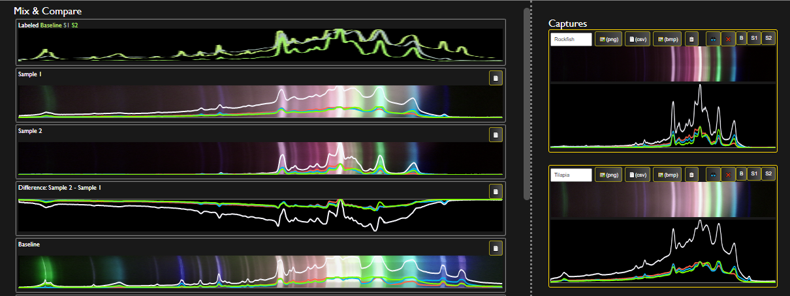

Digital spectrometer workbench, works with any webcam or image/video uploads. This is a pre-alpha functional test.

## Resources
- [Machine Learning Image Identification Demo](https://github.com/joshbrew/cameraId-wonnx-wasm)
- [3D printable Spectrometer Viewer](https://a360.co/3FZsu7q)
- [Spectrometer Workbench Demo](https://fishscanner.com)
- [Original Theremino DIY Guide](https://www.theremino.com/wp-content/uploads/files/Theremino_Spectrometer_Construction_ENG.pdf)

Find the (incoming) 3D-printable STL files for the spectrometer parts in this repository. The slit uses two single-edge steel straight razor blades then screws together for whatever slit width you want. The camera is a basic Arducam without the IR-CUT filter, and the diffraction grating is cheap 1000 line/mm visible-light grating that you can find in sheets or pre-cut in children's science kits, which tapes or clues over a square that fits over the lens. 

To run:
`tinybuild`

Or `npm i -g tinybuild` then the above command.

Software example (cropped):

My first test of a tabletop spectrometer using a 1080p wifi cam, 1000 line/mm off-the-shelf diffraction grating (e.g. from Amazon), black foam board, and a lot of tape:

Results - sunlight through my window:

By Joshua Brewster, Yassine Santissi, and Garrett Flynn.

This project is being developed for creating a fish identification dataset. 

###### Sponsored by [Schmidt Marine](https://www.schmidtmarine.org/) Foundation.

We recommend using the 1080p Arducam with an 8mm lens with no IR-CUT filter or night vision LEDs (you can just unplug them if they come with it). The diffraction grating is the one from children's toy science kits. The box, well we just used what was within reach... 

We're going to develop our own dedicated low cost solution to help run mass data collection experiments to test fish being sold on the market for quality, correct identification, etc. purposes.
