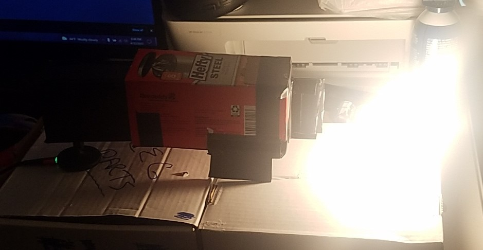
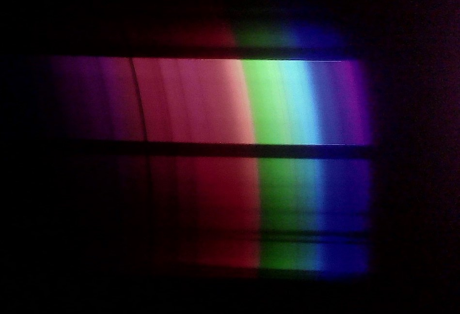

# DIY Digital Spectroscopy

This repository contains free digital spectroscopy software and 3D printable .3mf files (by Davis Fay and Bernard Markus) for an Arducam + 10deg-20deg lens digital spectroscope. Uses stock 1000 line/mm diffraction grating sheets over the lens. The slit uses single edge stainless steel razor blades glued to an adjustible front plate for precise slit width control, we achieved <0.05mm easily with a spacer.

## Resources
- [Spectrometer Workbench Demo](https://camspectrometer.netlify.app)
- [Machine Learning Image Identification Demo](https://github.com/joshbrew/cameraId-wonnx-wasm)
- [Original Theremino DIY Guide](https://www.theremino.com/wp-content/uploads/files/Theremino_Spectrometer_Construction_ENG.pdf)
- [DIY Hyperspectral imaging paper](https://www.mdpi.com/2313-433X/7/8/136)

### Revision 2 Phone and Arducam Mounts by Davis Fay:

<table>
  <tr>
    <td>
      
    </td>
    <td>
      
    </td>
  </tr>
  <tr>
    <td>
      
    </td>
    <td>
      
    </td>
  </tr>
</table>

### Revision 1 by Bernard Markus:

<table>
  <tr>
    <td>
      
    </td>
    <td>
      
    </td>
    <td>
      
    </td>
  </tr>
  <tr>
    <td>
      
    </td>
    <td>
      
    </td>
  </tr>
</table>

Recommended print settings: 
- .4mm nozzle, 
- PLA on default settings is fine.
- 2 perimeters (important!)
- 20% infill.
- Use Supports on 90deg overhang areas (. Not needed anywhere else

Additionally required:
- 1080p Arducam + 10deg or 20deg M12 lens. Remove IR filters over lenses for more bandwidth.
- - We are still working on identifying the best off the shelf sources (they all have different presets).
- 1000 line/mm diffraction grating, tape it over the rectangular piece that fits over the lenses. You can find these stock online in kid's science kits.
- Clip-on or keychain LED flashlight/Headlamp. [Our Preference](https://www.amazon.com/Flashlight-800Lumens-180%C2%B0Rotatable-Rechargeable-Flashlights/dp/B0B8N5BK8N?pd_rd_i=B0B8N5BK8N&psc=1&ref_=pd_bap_d_grid_rp_0_8_t)
- Uses single edge stainless steel razor blades glued over the slit
- The screws on the front plate for adjusting the slit are M1.6 12mm. You can use a sheet of paper as spacer.
- The back mounted handles use 4 M3 8mm screws. 

Make sure the diffraction grating is aligned vertically with the slit. The camera rotation should be so that the image is horizontal, you can have it aligned right to left or left to right for increasing wavelength at your preference.

## Software demo

Perform digital spectral decomposition in your browser! 

This repo comes with a digital spectrometer workbench prototype, works with any webcam or image/video uploads. This is a pre-alpha functional test. See the live demo at https://camspectrometer.netlify.app built directly from this repo using Netlify.

See also: [WONNX Camera ID Demo](https://github.com/joshbrew/cameraId-wonnx-wasm) for a real time video classifier demo, which we're working on hooking up to the spectrogram outputs as well for a proof of concept.

To run:
`npm start` or `tinybuild`

Or `npm i -g tinybuild` then the above command.

Software example (cropped):

My first test of a tabletop spectrometer using a 1080p wifi cam, 1000 line/mm off-the-shelf diffraction grating (e.g. from Amazon), black foam board, and a lot of tape:

Results - sunlight through my window:

- Not yet added: wavelength estimation, etc. 

All of the prototypes by Bernard:
- [Draft Viewer from Bernard Markus](https://a360.co/3FZsu7q)

### Credits
- 3D print files by Bernard Markus and Davis Fay
- Spectrometer software demo by Joshua Brewster and Garrett Flynn.
- Fishazam project by Yassine Santissi.
- This project is being developed for creating a fish identification dataset. 

Inspired by the [Theremino spectrometer tutorial](https://www.theremino.com/wp-content/uploads/files/Theremino_Spectrometer_Construction_ENG.pdf), with a much needed update using an accessible browser framework. You can use this to build your own.

###### Sponsored by [Schmidt Marine](https://www.schmidtmarine.org/) Foundation.

We recommend using the 1080p Arducam with an 8mm lens with no IR-CUT filter or night vision LEDs (you can just unplug them if they come with it). The diffraction grating is the one from children's toy science kits. The box, well we just used what was within reach... 

We're going to develop our own dedicated low cost solution to help run mass data collection experiments to test fish being sold on the market for quality, correct identification, etc. purposes.
